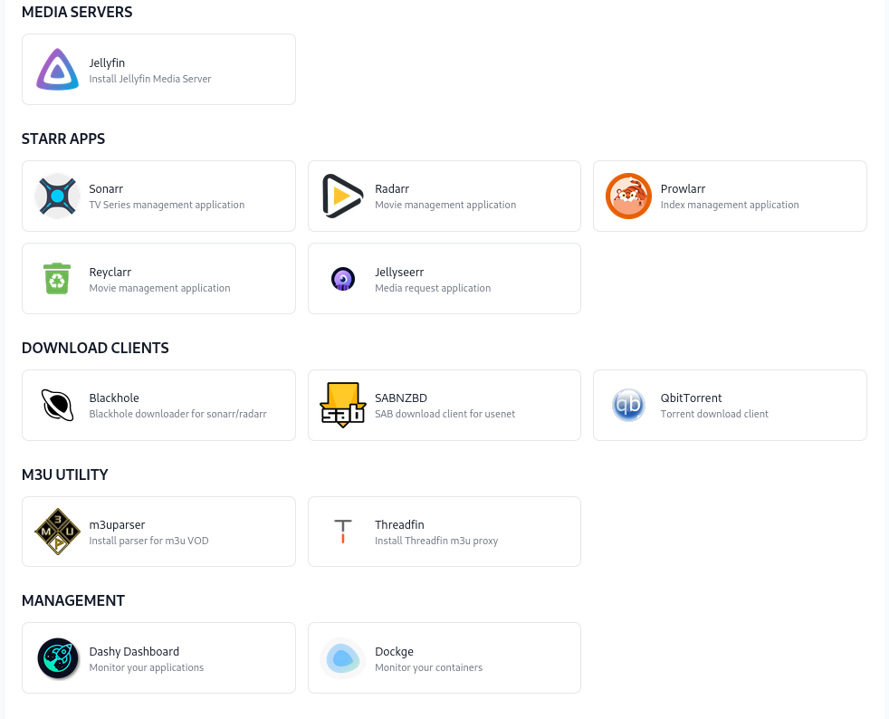
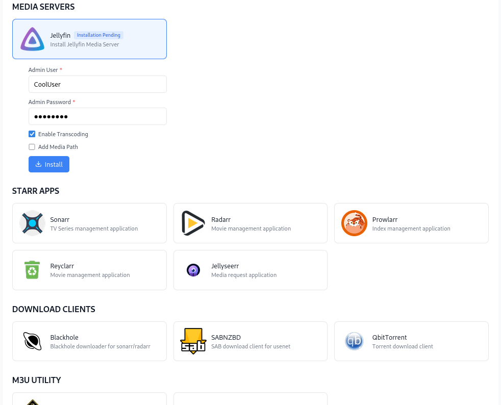
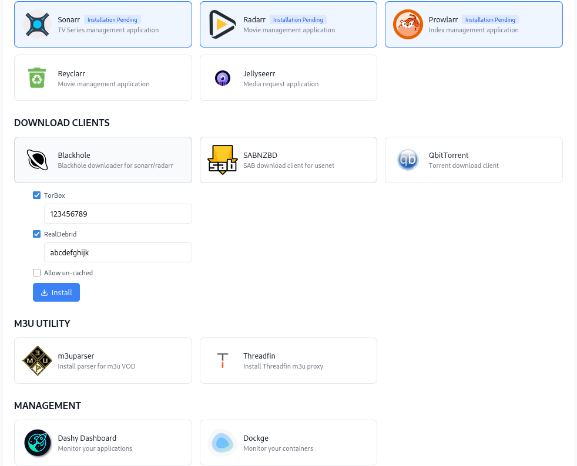
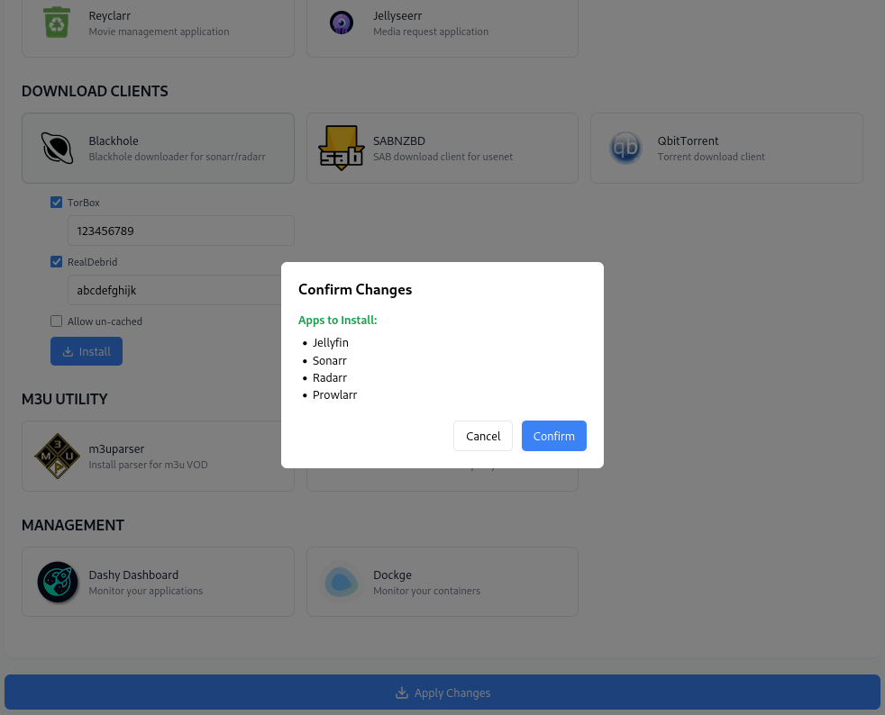
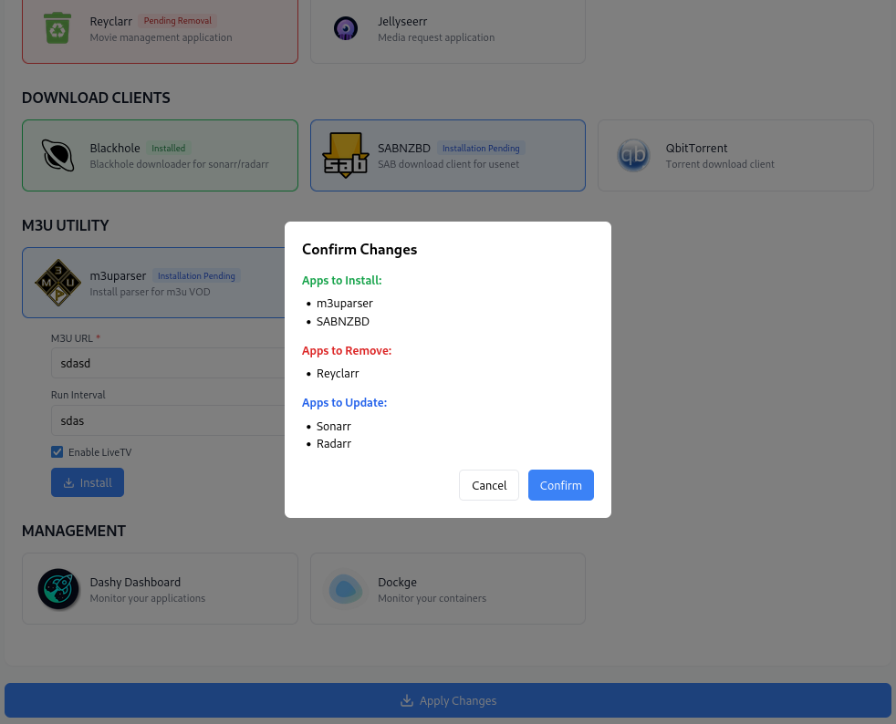
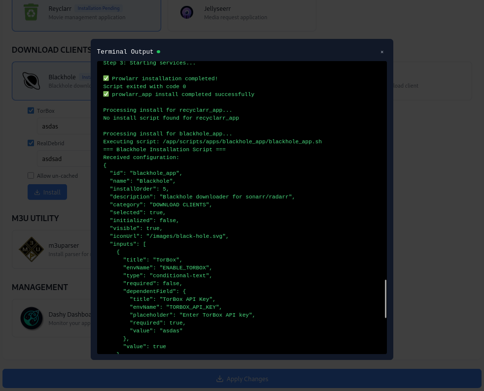

# **M.E.S.S**

## CURRENT STATE

This currently is a work in progress and only exists as a proof of concept. The web ui skeleton is working, but no scripting/automation is currently implemented.

###### What will MESS do?

**M**edia **E**ssentials **S**erver **S**etup aims to help setting up a media server by exposing a web ui to select applications to install (EVERYTHING IS IN DOCKER, NO BARE METAL). It will allow you to pass any necessary configuation settings, as well as use set up scripts, to avoid as much user interaction as possible.

Example scenario. You select radarr, sonarr, prowlarr, and qbittorent from the web ui and click install/apply. MESS will then pull the docker images for each application, retrieve the api keys for each arr app, configure prowlarr/radarr/sonarr with each others respective api keys, set qbit torrent as a download client, and any other necessary settings or configurations. So after installing from the MESS web ui, your applications will be ready to use without needing to configure each one yourself.

###### What will be available to install?

The initial apps that plan to be available are:

**Media Servers**: Jellyfin

**Arr Apps**: Radarr, Sonarr, Prowlarr, Recyclarr, Jellyseerr

**Download Clients**: QbitTorrent, SABNZBD, various blackholes that integrate with debrid providers (rclone), Pinchflat (youtube downloader)

**Management Tools**: Dockge, Dashy, Threadfin, guide2go (schedules direct), m3uparaser (parse VOD content from m3u to create .strm files)

