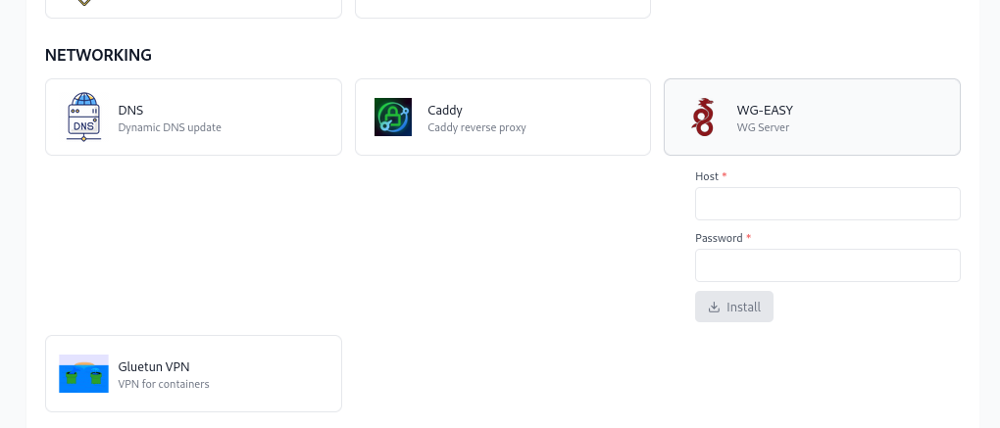

# **M.E.S.S**

## What will MESS do?

**M**edia **E**ssentials **S**erver **S**etup aims to help setting up a media server by exposing a web ui to select applications to install (EVERYTHING IS IN DOCKER, NO BARE METAL). It will allow you to pass any necessary configuation settings, as well as use set up scripts, to avoid as much user interaction as possible.

Example scenario. You select radarr, sonarr, prowlarr, and qbittorent from the web ui and click install/apply. MESS will then pull the docker images for each application, retrieve the api keys for each arr app, configure prowlarr/radarr/sonarr with each others respective api keys, set qbit torrent as a download client, and any other necessary settings or configurations. So after installing from the MESS web ui, your applications will be ready to use without needing to configure each one yourself.

## CURRENT STATE

M.E.S.S is currently in a pre alpha state. However, apps that can be installed that will work include:
Jellyfin, Radarr, Sonarr, Prowlarr, Threadfin, M3UParser, Jellyseerr, Dockge, Decypharr (blackhole download client)

Some apps require other apps to be installed, for instance, you will not be able to install Sonarr or Radarr unless you also have Prowlarr set to be installed.

Some apps will have required fields before they can be installed, Decypharr for instance will require a valid realdebrid apikey, and a realdebird webdav username/password.

Some apps will also intall or run other docker containers as a dependency. Decypharr will run rclone-manager along side the decypharr container to mount your real debrid webdav folder.

The ability to update an app (with the wb ui update button) currently does nothing. Only the install/remove buttons function. If you want to update a containers image you may do that manually by going to the /compose/installed/\<container_name\> and run a docker compose pull command. Or if you installed dockge you can use the dockge web ui to update the container image.

## INSTALL

Clone this repo to any location on your host machine

`git clone https://github.com/Xaque8787/MESS.git` 

Nothing in the docker-compose.yaml needs to be changed but you can edit the MASTER_KEY variable to any 24 or 26 character string if you would like.

From the repo directory run

`docker compose up -d`

The web ui is now available at `localhost:3001`

Be sure you select the install button on apps once you have entered in credentials (idicated by a blue outline "pending install")

## TO DO

- [ ] Implement update function to allow additional/revision to inputs

- [ ] Format install scripts to check for additional options if present (currently only supported options are installed and there is no "if" check for other options)

- [ ] Add advanced options for more granular control over app settings/config

- [ ] Implement a pull down menu for inputs (currently only text field or check box exist)

- [ ] Save logs to a file

- [ ] Make web ui more flexible when selecting or un selecting apps.

- [ ] Configure mess_api_docker package to be more flexible to accomodate updating app inputs. (use PUT instead of POST where possible, seperate api calls to be more modular)

- [ ] Create a cli for mess_api_docker to call functions with passed arguments from web ui

## What will be available to install?

The initial apps that plan to be available are:

**Media Servers**: Jellyfin

**Arr Apps**: Radarr, Sonarr, Prowlarr, Recyclarr, Jellyseerr

**Download Clients**: QbitTorrent, SABNZBD, various blackholes that integrate with debrid providers (rclone), Pinchflat (youtube downloader)

**Management Tools**: Dockge, Dashy, Threadfin, guide2go (schedules direct), m3uparaser (parse VOD content from m3u to create .strm files)

## 

